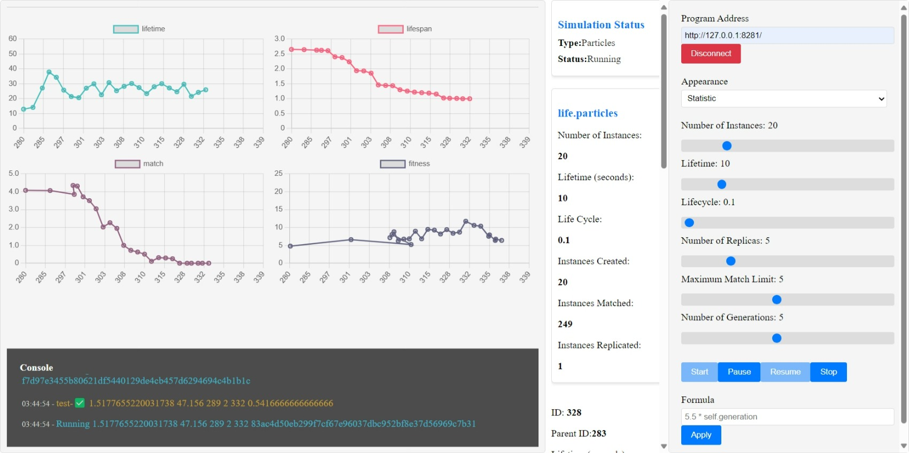

# Life Simulation System Overview

🔖 Version: 0.2.1

## Introduction
The **Life Simulation System** is designed to simulate, observe, and analyze the lifecycle and interactions of various software programs. It comprises three interconnected applications that work together seamlessly:

1. **Programlet Application (Life):** The server application responsible for running the programs in the background.
2. **Main Application (Life-UI):** The primary application that manages the system and communicates with the Programlet Application.
3. **Observation and Intervention Screen (Life-UI Screen):** A user interface application that enables observation and intervention of the programs and the main application.

---

## Features

### Observation Tools
The Observation and Intervention Screen provides the following tools to monitor and analyze the system:

- **Directory:** Real-time status information of programs displayed in a directory list.
- **Family:** Shows the relationships between programs for better understanding of dependencies.
- **Statistics:** Displays program-specific details such as lifespan, remaining lifespan, number of matches, and success rates (fitness).
- **Particle Simulation:** Simulates the positions, speed, and momentum of programs at the atomic level using scientific laws.

### Parameters
The system allows configuration of various simulation parameters:

- **Number of Samples:** The initial number of program instances.
- **Lifespan:** The duration (in seconds) each instance can survive.
- **Life Cycle:** Temporal scaling coefficient for the simulation.
- **Number of Copies:** The number of copies each program creates.
- **Maximum Matching Limit:** Maximum allowable matches for an instance.
- **Number of Generations:** The limit on how many generations of instances can be preserved.

### Actions
Control the simulation with the following actions:

- **Start:** Begin the simulation with the specified parameters.
- **Pause:** Temporarily halt the simulation.
- **Continue:** Resume a paused simulation.
- **Stop:** End the simulation entirely.

> **Note:** Intensive simulations may cause temporary delays or suspensions in server operations.

### Formula
Define custom formulas to dynamically modify how program lifespans are calculated during the simulation. This allows for tailored behavior and experimentation.

### Console
Monitor system logs and transaction details for both the programs and the main application in real-time.

### Simulation Signals
- **Type and Status of Simulation**
- **Status Information from the Server**

#### Main Application Signals
- Number of Instances
- Lifetime (seconds)
- Life Cycle
- Instances Created, Matched, and Replicated

#### Program Signals
- **ID:** Unique identifier for the program instance.
- **Parent ID:** Identifier of the parent program (if applicable).
- **Lifetime:** Total lifespan in seconds.
- **Elapsed Lifespan:** Duration since the instance was created.
- **Life Cycle:** Temporal cycle applied to the instance.
- **Status:** Current state of the program.
- **Copies and Generations:** Replication details.
- **Match Count and Fitness:** Interaction and performance metrics.
- **Assembly Codes:** Final assembly code snapshot.

---

## Use Cases

### 1. **Evolutionary Algorithms**
Simulate natural selection and genetic evolution by replicating, matching, and analyzing program success rates (fitness).

### 2. **System Performance Analysis**
Optimize and evaluate program lifecycle and performance to improve efficiency in distributed systems or microservices.

### 3. **Scientific Modeling**
Use atomic-level simulation tools to model physical, chemical, or biological phenomena under real-world constraints.

---

## Summary
The **Life Simulation System** provides a robust platform for:

- Real-time monitoring and control of program behaviors.
- Simulation of complex processes.
- Scientific experimentation and performance analysis.

Whether you're working on evolutionary algorithms, distributed systems, or scientific modeling, this system delivers a flexible and powerful solution.

---

## Contact
For more information or collaboration opportunities, please reach out to the development team.

## Getting Started
Documentation
The project documentation is available in the docs: docs/ directory.

* [Documentation](docs/README.md).

## Prerequisites
To contribute to this project, you will need the following:

 ✅ [Docker](https://www.docker.com/) installed and configured

 ✅ [Visual Studio Code](https://code.visualstudio.com/) installed
 
 ✅ Familiarity with the Dockerfile format and [Development Container](https://containers.dev/)

## Contribution
To contribute to this project, please review the Participant Agreement: CODE_OF_CONDUCT.md and follow the guidelines in the Contributing: CONTRIBUTING.md document.

[How to Provide Storey](CONTRIBUTING.md)

[Code of Conduct](CODE_OF_CONDUCT.md).