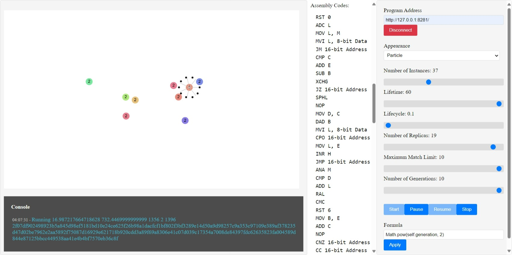

# Life

The applications work as three different applications in total.

First application: Programlet application [ Life ]
The server where the programs run: It runs in the background.

Second app: Main app [ Life-UI ]
The server on which the main application runs. It runs in the background.

Third application: Observation and Intervention screen. [ Life-UI Screen]
It is a user interface application where all operations of main applications and programs can be observed and intervened.

These three applications are designed to communicate among themselves.

# Observation

Now we look at the observation screen.

The section on the right contains the necessary tools and definitions.
The left part is the observation screen.

# Toolbar

Program Address: Here we define the address where programs run and communicate.
It is currently running on a local server.
Once the connection is established, the Main application and the Program application are ready to communicate with each other.

View: There are different sets of observation tools when observing.

* Directory: This is the area where the status information of the programs is instantly observed in the form of a directory list.

* Family: This is the area where relations between programs can be observed instantly.

* Statistics: Programs' lifespan (in seconds), remaining lifespan (in seconds), how many matches they have made, and success rates as a result of their activities (fitness).

* Particle: This is the area where we try to simulate the programs by calculating their positions at the atomic level and calculating the speed and momentum information with existing scientific laws.

# Parameter

Number of Samples: We specify the number of samples to be created at the initial level.

Lifespan: We define how long each copy can survive (in seconds)

Life Cycle: The coefficient we scale to simulate the temporal concept of the instances (in seconds but also sensitive to milliseconds)

Number of Copies: how many copies of themselves programs make

Maximum Matching Limit: Maximum number of times samples can be matched with another sample with a compatible value.

Number of Generations: Limit on how many generations of new copies of samples created as a result of replication can be preserved.

# Action

Start: Programs start being simulated with initial parameters.
Pause: Temporarily pauses the simulation.
Continue: Continues the simulation.
Stop: Stops the simulation.

Note: When the activities here are run very intensively on the server, some waiting and stopping operations may be suspended.

# Formula

Formula: This is the field used to intervene in the programs by entering formulas after the simulation starts running.
For now, the formulas entered here are applied to the part of how to calculate the life of the programmer.
In summary, the formula is used to determine the lifespan of the program.

# Console
Console: This is the area where all transaction logs of programs and the main application are observed.

# Simulation Status

Simulation Signals:

* Type and status of simulation
* Status information sent by the server that created the samples

Main application Signals:

* Number of Instances: Number of samples processed.
* Lifetime (seconds): Lifetime applied to all instances.
* Life Cycle: The time cycle applied to all instances.
* Instances Created: The number of instances created so far.
* Instances Matched: Total instances matched.
* Instances Replicated: Total instances replicated.

Program signals:

* ID: For example, identification number.
* Parent ID: The parent of the example. (If present, otherwise 0)
* Lifetime (seconds): Total life of the example in seconds
* Life Created Time: The time the example was created.
* Life Start Time: For example, when life starts.
* Elapsed Lifespan: For example, life span.
* Life Cycle: For example, the life cycle.
* Life Status: For example, current situation.
* Number of Copies: Total copies of the sample.
* Generation: Which generation the sample is in.
* Match Count: For example, how many matches have been made.
* Fitness: For example, passing grade.
* Assembly Codes: The last assembly code of the example.
